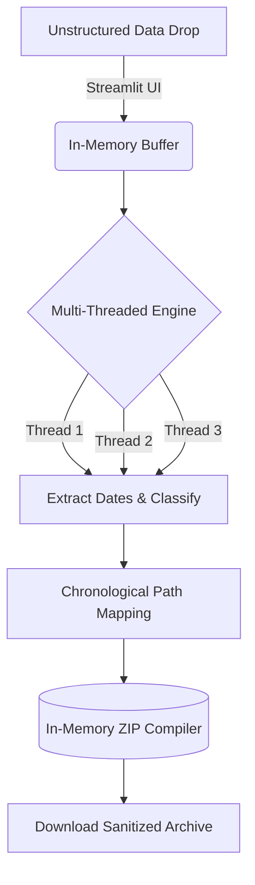

Multi-Threaded Data Room Sanitizer

An enterprise-grade, high-throughput pipeline designed to ingest, classify, and restructure chaotic client data dumps during massive M&A due diligence or litigation discovery.

Law firms are routinely bombarded with thousands of poorly named, unstructured files (`scan_001.txt`, `IMG_8472.jpg`). This tool replaces hundreds of billable hours of manual triage with a zero-trust, multi-threaded sorting engine wrapped in a clean SaaS-style interface.

## System Architecture



## Core Engineering Highlights

* **High-Throughput Concurrency:** Bypasses single-threaded bottlenecks by executing file parsing across a concurrent thread pool (`concurrent.futures`), maximizing CPU I/O.
* **In-Memory ZIP Compilation:** Uses `io.BytesIO` and `zipfile` to construct the entire sanitized folder architecture dynamically in RAM. No intermediary files are written to the local disk, ensuring strict data privacy and zero residual footprints.
* **Heuristic Classification:** Decouples structural file generation from unreliable OS-level modification dates by parsing text-boundary regex for internal document dates and legal entities.
* **SaaS UI/UX:** Wraps complex data pipeline logic in a reactive, native-app styled dashboard using custom CSS injection.

## Tech Stack

* **Language:** Python 3
* **Concurrency:** `ThreadPoolExecutor`
* **UI Framework:** Streamlit (with custom CSS/HTML)
* **Data Handling:** Pandas, Regex, IO Buffers

---

## Local Deployment Guide

1. Clone the repository:
```bash
git clone [https://github.com/YOUR_USERNAME/legaltech-data-sanitizer.git](https://github.com/YOUR_USERNAME/legaltech-data-sanitizer.git)
cd legaltech-data-sanitizer

```


2. Install the required dashboard dependencies:
```bash
pip install streamlit pandas

```


3. Launch the local web server:
```bash
streamlit run app.py

```


4. **Usage:** Drag and drop any raw, unstructured `.txt` files into the browser interface. The pipeline will instantly parse the legal text, generate a live audit log, and compile a structurally perfect `.zip` archive for download.

```

---


